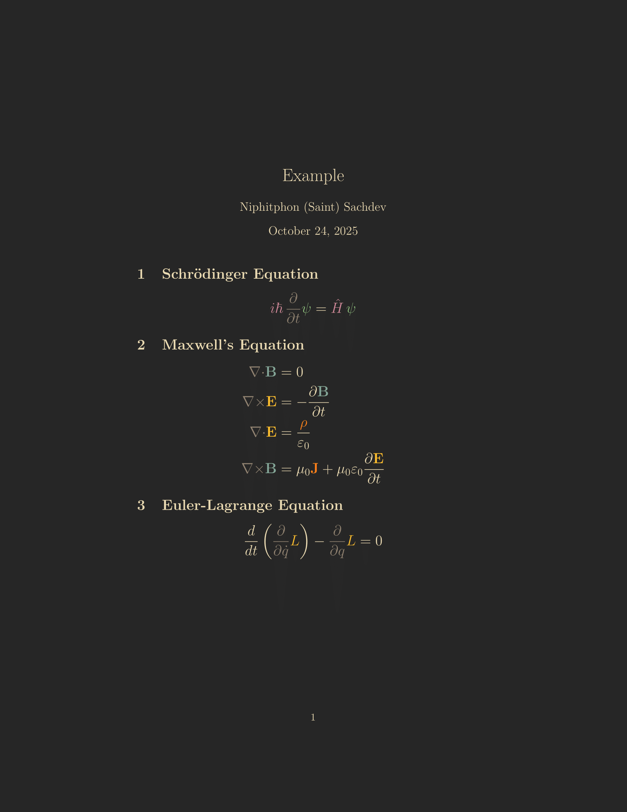

# Gruvbox for LaTeX

<p align="center">
	<br/>
	Gruvbox for <a href="https://www.latex-project.org/">LaTeX</a>	
</p>

---



<p align="center">
    Content table will be added at a later time
</p>

## Usage

### Importing the theme file

> [!NOTE]
> I have included the `.sty` file, so you can just drag and drop!

1. Extract the `.sty` file from `gruvboxpalette.dtx`:

   ```bash
   l3build unpack
   ```

   Or manually copy the package code from `gruvboxpalette.dtx` to `gruvboxpalette.sty`.

2. Place `gruvboxpalette.sty` in your project directory or in your local TeX path

3. Import the package by adding `\usepackage{gruvboxpalette}` to your LaTeX document

### Package Options

> [!IMPORTANT]
> There is no light theme yet, feel free to make one!

- `style`: Set the active style (default: `Dark`)
  - `\usepackage[dark]{gruvboxpalette}`
- `textcolor`: Set default text color to `GruvboxForeground` (default: `true`)
- `pagecolor`: Set page background to `GruvboxBackground` (default: `true`)
- `hyperref`: Style hyperref links according to Gruvbox (default: `true`)
- `styleAll`: Enable all styling options

### Color Naming

All Gruvbox colors follow the naming convention `Gruvbox<Style><Color>`, e.g., `GruvboxDarkRed`.

Shortcut names without style prefix point to the active style:

- `GruvboxRed`, `GruvboxGreen`, `GruvboxBlue`, etc.
- `GruvboxBg0`, `GruvboxBg1`, etc. (background layers)
- `GruvboxFg0`, `GruvboxFg1`, etc. (foreground layers)

> [!TIP]
> If you are tired of typing out the full <code class="latex">\textcolor{...}</code>
> It is possible to define new commands in latex
>
> ```latex
> \newcommand{\Aqua}[1]{\textcolor{GruvboxDarkAqua}{#1}}
> ```
>
> now you can just type out \Aqua and it should be the color you want!, this works especially well if you are using only one theme and aren't switching.

### Mid-document Style Changes

Use `\GruvboxReinit[options]` to change settings mid-document:

```latex
\GruvboxReinit[textcolor=false]
```

## Colors

#### Dark Style

|                      Swatch                       |       Color       |    Hex    |      RGB      |
| :-----------------------------------------------: | :---------------: | :-------: | :-----------: |
|  |  GruvboxDarkRed   | `#FB4934` |  251, 73, 52  |
|  | GruvboxDarkGreen  | `#B8BB26` | 184, 187, 38  |
|  | GruvboxDarkYellow | `#FABD2F` | 250, 189, 47  |
|  |  GruvboxDarkBlue  | `#83A598` | 131, 165, 152 |
|  | GruvboxDarkPurple | `#D3869B` | 211, 134, 155 |
|  |  GruvboxDarkAqua  | `#8EC07C` | 142, 192, 124 |
|  | GruvboxDarkOrange | `#FE8019` | 254, 128, 25  |
|  |  GruvboxDarkGray  | `#928374` | 146, 131, 116 |

#### Background Layers

|                      Swatch                       |     Color      |    Hex    |      RGB      |
| :-----------------------------------------------: | :------------: | :-------: | :-----------: |
|  | GruvboxDarkBg0 | `#282828` |  40, 40, 40   |
|  | GruvboxDarkBg1 | `#3C3836` |  60, 56, 54   |
|  | GruvboxDarkBg2 | `#504945` |  80, 73, 69   |
|  | GruvboxDarkBg3 | `#665C54` |  102, 92, 84  |
|  | GruvboxDarkBg4 | `#7C6F64` | 124, 111, 100 |

---

#### Foreground Layers

|                      Swatch                       |     Color      |    Hex    |      RGB      |
| :-----------------------------------------------: | :------------: | :-------: | :-----------: |
|  | GruvboxDarkFg0 | `#FBF1C7` | 251, 241, 199 |
|  | GruvboxDarkFg1 | `#EBDBB2` | 235, 219, 178 |
|  | GruvboxDarkFg2 | `#D5C4A1` | 213, 196, 161 |
|  | GruvboxDarkFg3 | `#BDAE93` | 189, 174, 147 |
|  | GruvboxDarkFg4 | `#A89984` | 168, 153, 132 |

## License

MIT License

## Thanks

Huge thanks to the [Catppuccin LaTeX package](https://github.com/catppuccin/latex) and the original [Gruvbox color scheme](https://github.com/morhetz/gruvbox) which inspired the theme. \
Thanks to the [ Catppuccin LaTeX package ](https://github.com/catppuccin/latex), which provided the foundation for this project. Much of the base code is adapted from theirs.
