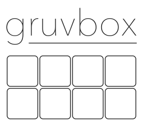

# Gruvbox for LaTeX

<p align="center">
	<br/>
	Gruvbox for <a href="https://www.latex-project.org/">LaTeX</a>	
</p>

<p align="center">
    section placeholder
</p>

## Usage

### Importing the theme file

> [!NOTE]
> I have included the `.sty` file, so you can just drag and drop!

1. Extract the `.sty` file from `gruvboxpalette.dtx`:

   ```bash
   l3build unpack
   ```

   Or manually copy the package code from `gruvboxpalette.dtx` to `gruvboxpalette.sty`.

2. Place `gruvboxpalette.sty` in your project directory or in your local TeX path

3. Import the package by adding `\usepackage{gruvboxpalette}` to your LaTeX document

### Package Options

> [!IMPORTANT]
> There is no light theme yet, feel free to make one!

- `style`: Set the active style (default: `Dark`)
  - `\usepackage[dark]{gruvboxpalette}`
- `textcolor`: Set default text color to `GruvboxForeground` (default: `true`)
- `pagecolor`: Set page background to `GruvboxBackground` (default: `true`)
- `hyperref`: Style hyperref links according to Gruvbox (default: `true`)
- `styleAll`: Enable all styling options

### Color Naming

All Gruvbox colors follow the naming convention `Gruvbox<Style><Color>`, e.g., `GruvboxDarkRed`.

Shortcut names without style prefix point to the active style:

- `GruvboxRed`, `GruvboxGreen`, `GruvboxBlue`, etc.
- `GruvboxBg0`, `GruvboxBg1`, etc. (background layers)
- `GruvboxFg0`, `GruvboxFg1`, etc. (foreground layers)

> [!TIP]
> If you are tired of typing out the full <code class="latex">\textcolor{...}</code>
> It is possible to define new commands in latex
>
> <pre><code class="latex">
> \newcommand{\Aqua}[1]{\textcolor{GruvboxDarkAqua}{#1}}
> </code></pre>
>
> now you can just type out \Aqua and it should be the color you want!, this works especially well if you are using only one theme and aren't switching.

### Mid-document Style Changes

Use `\GruvboxReinit[options]` to change settings mid-document:

```latex
\GruvboxReinit[textcolor=false]
```

## Colors

#### Dark Style

| Swatch                                                                                                                                                                | Color             | Hex       | RGB           |
| --------------------------------------------------------------------------------------------------------------------------------------------------------------------- | ----------------- | --------- | ------------- |
|                                                                                                               | GruvboxDarkRed    | `#FB4934` | 251, 73, 52   |
| <circle cx='6' cy='6' r='6' fill='%23B8BB26'/></svg>" alt="#B8BB26"> | GruvboxDarkGreen  | `#B8BB26` | 184, 187, 38  |
| <circle cx='6' cy='6' r='6' fill='%23FABD2F'/></svg>" alt="#FABD2F"> | GruvboxDarkYellow | `#FABD2F` | 250, 189, 47  |
| <circle cx='6' cy='6' r='6' fill='%2383A598'/></svg>" alt="#83A598"> | GruvboxDarkBlue   | `#83A598` | 131, 165, 152 |
| <circle cx='6' cy='6' r='6' fill='%23D3869B'/></svg>" alt="#D3869B"> | GruvboxDarkPurple | `#D3869B` | 211, 134, 155 |
| <circle cx='6' cy='6' r='6' fill='%238EC07C'/></svg>" alt="#8EC07C"> | GruvboxDarkAqua   | `#8EC07C` | 142, 192, 124 |
| <circle cx='6' cy='6' r='6' fill='%23FE8019'/></svg>" alt="#FE8019"> | GruvboxDarkOrange | `#FE8019` | 254, 128, 25  |
| <circle cx='6' cy='6' r='6' fill='%23928374'/></svg>" alt="#928374"> | GruvboxDarkGray   | `#928374` | 146, 131, 116 |

#### Background Layers

|                                                                                Swatch                                                                                 | Color          |    Hex    |      RGB      |
| :-------------------------------------------------------------------------------------------------------------------------------------------------------------------: | :------------- | :-------: | :-----------: |
| <circle cx='7' cy='7' r='7' fill='%23282828'/></svg>" alt="#282828"> | GruvboxDarkBg0 | `#282828` |  40, 40, 40   |
| <circle cx='7' cy='7' r='7' fill='%233C3836'/></svg>" alt="#3C3836"> | GruvboxDarkBg1 | `#3C3836` |  60, 56, 54   |
| <circle cx='7' cy='7' r='7' fill='%23504945'/></svg>" alt="#504945"> | GruvboxDarkBg2 | `#504945` |  80, 73, 69   |
| <circle cx='7' cy='7' r='7' fill='%23665C54'/></svg>" alt="#665C54"> | GruvboxDarkBg3 | `#665C54` |  102, 92, 84  |
| <circle cx='7' cy='7' r='7' fill='%237C6F64'/></svg>" alt="#7C6F64"> | GruvboxDarkBg4 | `#7C6F64` | 124, 111, 100 |

---

#### Foreground Layers

|                                                                                Swatch                                                                                 | Color          |    Hex    |      RGB      |
| :-------------------------------------------------------------------------------------------------------------------------------------------------------------------: | :------------- | :-------: | :-----------: |
| <circle cx='7' cy='7' r='7' fill='%23FBF1C7'/></svg>" alt="#FBF1C7"> | GruvboxDarkFg0 | `#FBF1C7` | 251, 241, 199 |
| <circle cx='7' cy='7' r='7' fill='%23EBDBB2'/></svg>" alt="#EBDBB2"> | GruvboxDarkFg1 | `#EBDBB2` | 235, 219, 178 |
| <circle cx='7' cy='7' r='7' fill='%23D5C4A1'/></svg>" alt="#D5C4A1"> | GruvboxDarkFg2 | `#D5C4A1` | 213, 196, 161 |
| <circle cx='7' cy='7' r='7' fill='%23BDAE93'/></svg>" alt="#BDAE93"> | GruvboxDarkFg3 | `#BDAE93` | 189, 174, 147 |
| <circle cx='7' cy='7' r='7' fill='%23A89984'/></svg>" alt="#A89984"> | GruvboxDarkFg4 | `#A89984` | 168, 153, 132 |

## License

MIT License

## Thanks

Huge thanks to the [Catppuccin LaTeX package](https://github.com/catppuccin/latex) and the original [Gruvbox color scheme](https://github.com/morhetz/gruvbox) which inspired the theme. \
Thanks to the [Catppuccin LaTeX package](https://github.com/catppuccin/latex) which had all the code ready and I really just modified from theirs, so this project wouldn't exist without them.
